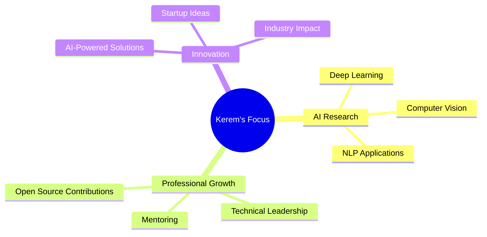

# 👋 Hello, World! I'm Kerem Erkengel

<div align="center">
  
</div>

<div align="center">
  
</div>

---

## 🎯 About Me

```typescript
const kerem = {
  role: "AI Engineer & Full-Stack Developer",
  location: "Turkey 🇹🇷",
  focus: ["Artificial Intelligence", "Machine Learning", "Web Development"],
  currentlyWorking: "Building intelligent systems that solve real-world problems",
  learning: ["Advanced Deep Learning", "MLOps", "Cloud Architecture"],
  askMeAbout: ["AI", "Python", "React", "Data Science", "Open Source"],
  funFact: "I believe AI will reshape every industry, and I want to be part of that transformation!"
};
```

<details>
<summary>🔍 More About My Journey</summary>

<br>

I'm passionate about leveraging cutting-edge technology to create meaningful solutions. My expertise spans across multiple domains:

- **🤖 AI & Machine Learning**: Developing intelligent systems using TensorFlow, PyTorch, and scikit-learn
- **🌐 Full-Stack Development**: Building scalable web applications with modern frameworks
- **📊 Data Science**: Extracting insights from complex datasets to drive decision-making
- **📝 Technical Writing**: Sharing knowledge through detailed articles and tutorials

</details>

---

## 🛠️ Technology Arsenal

<div align="center">

### 🔥 Core Technologies


### 🤖 AI & Data Science


### 🛠️ Development Tools


### ☁️ Cloud & Deployment


</div>

---

## 📈 GitHub Analytics

<div align="center">
  
  
</div>

<div align="center">
  
</div>

<div align="center">
  
</div>

---

## 🚀 Featured Projects

<div align="center">

### 💼 Professional Projects

<table>
<tr>
<td width="50%">

**🏦 Savings Tracker Pro**
> Advanced personal finance management system with AI-powered insights

[](https://github.com/keremerkengel/savings-tracker-pro)

**Tech Stack:** React, Node.js, MongoDB  
**Features:** Budget tracking, Financial analytics, Goal setting

</td>
<td width="50%">

**🧠 MNIST Handwriting Recognition**
> Deep learning model for handwritten digit classification

[](https://github.com/keremerkengel/mnist-el-yazisi-tanima)

**Tech Stack:** Python, TensorFlow, Keras  
**Accuracy:** 98.5% on test dataset

</td>
</tr>
<tr>
<td width="50%">

**🎬 Film Recommendation System**
> Machine learning-powered movie recommendation engine

[](https://github.com/keremerkengel/film-oneri-sistemi)

**Tech Stack:** Python, Pandas, Scikit-learn  
**Algorithm:** Collaborative filtering, Content-based

</td>
<td width="50%">

**🗺️ Concept Map Generator**
> AI-powered educational tool for visual learning

[](https://github.com/keremerkengel/Kavram_Haritasi_Olusturucu)

**Tech Stack:** Python, NetworkX, NLP  
**Use Case:** Educational visualization

</td>
</tr>
</table>

</div>

---

## ✍️ Technical Writing & Knowledge Sharing

<div align="center">

### 📝 Featured Medium Articles

<a href="https://medium.com/@keremerkengel/veriyle-yolculuk-makine-%C3%B6%C4%9Frenmesinde-veri-%C3%B6n-i%CC%87%C5%9Fleme-rehberi-d5a10656fe1e" target="_blank">
  
</a>

<a href="https://medium.com/@keremerkengel/makine-%C3%B6%C4%9Frenmesi-verilerle-%C3%B6%C4%9Frenen-sistemler-fc4b7b0296ce" target="_blank">
  
</a>

### 📚 Article Topics
- **Data Science & ML**: Comprehensive guides on machine learning workflows
- **AI Applications**: Practical implementations of AI in real-world scenarios
- **Tech Tutorials**: Step-by-step development guides

</div>

---

## 🎯 Current Focus & Goals

<div align="center">



</div>

### 🎯 2024 Goals
- [ ] Contribute to 5+ major open-source AI projects
- [ ] Publish 12 technical articles on Medium
- [ ] Build and deploy 3 production-ready AI applications
- [ ] Speak at 2 tech conferences/meetups
- [ ] Mentor 10+ junior developers

---

## 🌐 Connect & Collaborate

<div align="center">

### 💬 Let's Build Something Amazing Together!

<a href="https://www.linkedin.com/in/keremerkengel/" target="_blank">
  
</a>
<a href="https://x.com/kerem_erkngl24" target="_blank">
  
</a>
<a href="https://www.instagram.com/kerem_erkngl24/" target="_blank">
  
</a>
<a href="https://medium.com/@keremerkengel" target="_blank">
  
</a>

### 📧 Professional Inquiries
**Email:** kerem.erkengel@example.com  
**Open to:** Collaborations, Consulting, Speaking Opportunities

</div>

---

## 💡 Fun Facts & Interests

<div align="center">

| 🎯 **Problem Solver** | 🌱 **Continuous Learner** | 🤝 **Team Player** |
|:---:|:---:|:---:|
| Love tackling complex challenges with elegant solutions | Always exploring new technologies and methodologies | Believe in the power of collaboration and knowledge sharing |

</div>

---

<div align="center">
  
  
  
  
  
  [](https://github.com/keremerkengel)
</div>
