<!-- Hero Section -->
<div align="center">
  
</div>

<div align="center">
  
</div>

<!-- About Me with Modern Cards -->
## 🚀 About Me

<div align="center">
  
```typescript
const kerem = {
  name: "Kerem Erkengel",
  location: "Turkey 🇹🇷",
  focus: ["Artificial Intelligence", "Full-Stack Development", "Data Science"],
  currentlyLearning: ["Advanced ML Algorithms", "Next.js 14", "PyTorch"],
  funFact: "I turn coffee into code ☕ → 💻",
  motto: "Code. Learn. Repeat. 🔄"
};
```

</div>

<div align="center">
  
</div>

---

## 🛠️ Tech Arsenal

<div align="center">

### 🎯 Core Technologies


### 🤖 AI & Data Science


### 🔧 Development Tools


</div>

---

## 📊 GitHub Analytics

<div align="center">
  
  
</div>

<div align="center">
  
</div>

---

## 🌟 Featured Projects

<div align="center">

### 💰 Financial Intelligence
<a href="https://github.com/keremerkengel/savings-tracker-pro">
  
</a>

### 🧠 AI & Machine Learning
<a href="https://github.com/keremerkengel/mnist-el-yazisi-tanima">
  
</a>

### 🎬 Recommendation Systems
<a href="https://github.com/keremerkengel/film-oneri-sistemi">
  
</a>

### 🗺️ Educational Tools
<a href="https://github.com/keremerkengel/Kavram_Haritasi_Olusturucu">
  
</a>

</div>

---

## ✍️ Latest Medium Articles

<div align="center">
  
<a href="https://medium.com/@keremerkengel/ad%C4%B1m-ad%C4%B1m-kendi-web-projelerini-i%CC%87n%C5%9Fa-et-frontende-yolculuk-4f369e82f78b" target="_blank">
  
</a>

<a href="https://medium.com/@keremerkengel/react-ile-i%CC%87lk-ad%C4%B1mlar-basit-bir-uygulama-nas%C4%B1l-yap%C4%B1l%C4%B1r-d43757c7b928b" target="_blank">
  
</a>

<a href="https://medium.com/@keremerkengel/tailwind-css-ile-h%C4%B1zl%C4%B1-ve-verimli-tasar%C4%B1mlar-fa6eeff74179" target="_blank">
  
</a>

</div>

---

## 🤝 Let's Connect & Collaborate

<div align="center">

<a href="https://www.linkedin.com/in/keremerkengel/" target="_blank">
  
</a>
<a href="https://x.com/kerem_erkngl24" target="_blank">
  
</a>
<a href="https://www.instagram.com/kerem_erkngl24/" target="_blank">
  
</a>
<a href="https://medium.com/@keremerkengel" target="_blank">
  
</a>

</div>

---

## 🎯 Current Goals

```mermaid
graph LR
    A[🎯 2024 Goals] --> B[Master Deep Learning]
    A --> C[Build 10 AI Projects]
    A --> D[Contribute to Open Source]
    A --> E[Launch SaaS Product]
    
    B --> F[PyTorch Expert]
    C --> G[Computer Vision]
    D --> H[GitHub Contributions]
    E --> I[AI-Powered App]
```

<div align="center">



</div>

---

<div align="center">
  
</div>

<div align="center">
  
</div>

---

<div align="center">
  
</div>
